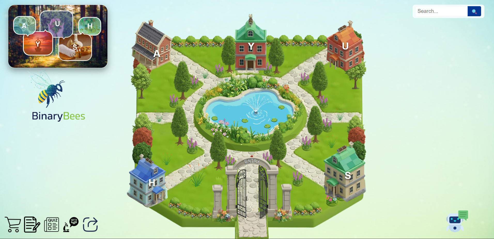
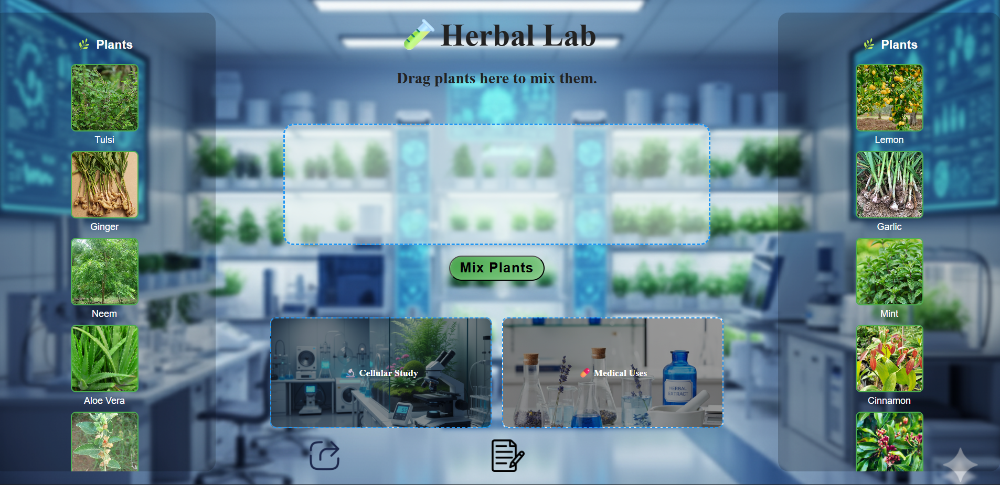
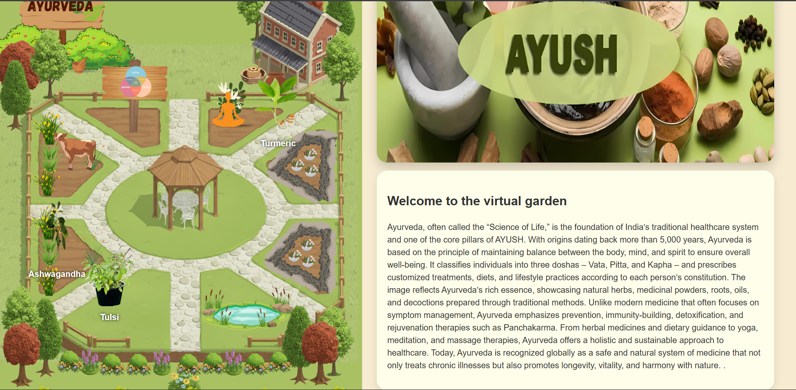

# 🌿 Virtual Herbal Garden

## 📊 Project Overview

A visually interactive web-based project that allows users to explore traditional medicinal systems like **Ayurveda, Unani, Siddha, Homeopathy, and Yoga** through an engaging virtual garden interface.

This project combines **education + interactivity + modern UI** to make learning about herbal medicine immersive and accessible.

---

## 🚀 Features

### 📌 Interactive Web Application

* 🌱 Interactive garden UI with clickable sections
* 📚 Information on multiple medicinal systems:

  * Ayurveda
  * Unani
  * Siddha
  * Homeopathy
  * Yoga & Naturopathy
* 🌿 Detailed plant pages (Tulsi, Turmeric, Ashwagandha, etc.)
* 🔍 Search bar for easy navigation

---

### 🎯 Additional Functionalities

* 🧠 Quiz section to test knowledge
* 🧪 Virtual lab simulation
* 📝 Built-in notepad for user notes
* 🤖 Integrated chatbot (Zapier-based)
* 🛒 Shopping redirect (Amazon integration)

---

## 🛠️ Tech Stack

* HTML5
* CSS3
* JavaScript
* Zapier Chatbot Integration

---

## 🗂️ Project Structure

```bash
Virtual Garden/
│
├── AYUSH/                 # Pages for different medicinal systems
├── plants/                # Main plant information pages
├── subplant/              # Detailed plant descriptions
├── extras/                # Quiz, Lab, Blog, Notepad
├── wallPages/             # Navigation pages
├── images/                # Background and UI images
├── icons/                 # Icons used in UI
├── index.html             # Main entry point
└── .hintrc                # Config file
```

---

## ⚙️ How to Run Locally

1. Clone the repository:

```bash
git clone https://github.com/KrishnaRangwani2526/Virtual-herbal-garden.git
```

2. Open the folder:

```bash
cd virtual-herbal-garden
```

3. Run the project:

* Open `background.html` in your browser

---

## 👥 Contributors

* Krishna Rangwani
* Arshi Khan

---

## 📌 Future Improvements

* Add backend for user authentication
* Store quiz scores and progress
* Improve search functionality
* Integrate database for plant information
* Make fully responsive for all devices

---

## 📷 Preview

### Main Interface

### Lab Area

### Ayurveda Interface


---

## 📄 License

This project is for educational purposes only.

---

## 💡 Inspiration

Inspired by the idea of combining **technology with traditional herbal knowledge** to create an engaging and interactive learning experience.
